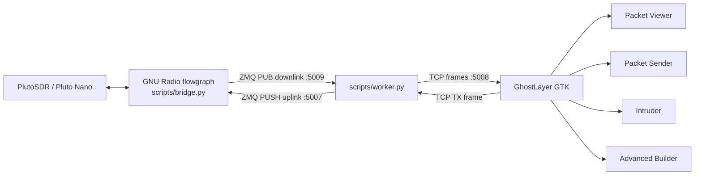
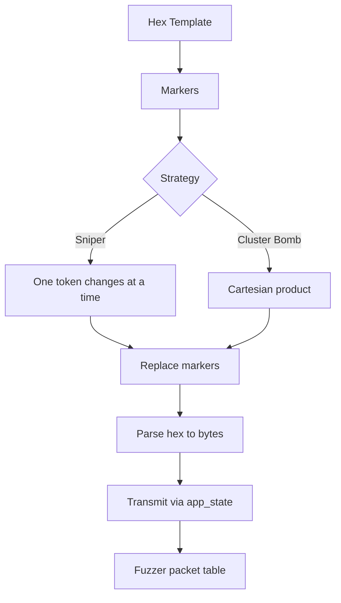

# GhostLayer

GhostLayer is a GTK interface for capturing, inspecting, crafting, replaying, and fuzzing CCSDS/SPP packets over a LoRa SDR link. The project combines a packet-analyzer style workflow with sender and fuzzing tools inspired by Burp Suite-like workflows.

> Intended use: owned labs, authorized hardware, and test links. It is not designed for use against third-party systems without explicit permission.

## Capabilities

- Captures packets from GNU Radio through ZeroMQ and displays them in a table with timestamp, length, protocol, and information.
- Dissects Space Packet Protocol (CCSDS SPP) and displays a field tree, bitfields, and hexdump.
- Saves and loads PCAP files for offline analysis.
- Sends an SPP packet from Packet Sender with APID, TM/TC type, sequence, secondary header flag, and radio configuration.
- Opens a captured packet in Packet Sender so it can be edited and transmitted once.
- Transmits a captured packet directly from Packet Viewer.
- Sends captured packets to Intruder for APID sweep, sequence fuzzing, or payload-list campaigns.
- Runs Advanced Builder with markers over hex templates, Sniper or Cluster Bomb strategy, numeric/list/character-block generators, and real progress tracking.
- Keeps Pluto RX/TX full duplex through the Python worker and explicit RX recovery after TX.

## Architecture



The GTK binary does not talk directly to the SDR. The worker is the bridge between the interface and GNU Radio.

## Runtime Flow

1. Start the worker:

   ```bash
   python3 scripts/worker.py -p ip:pluto.local
   ```

2. Open GhostLayer:

   ```bash
   ./build/ghostlayer
   ```

3. Open `iFace` from the toolbar if you need to change the TCP port.
4. Enable `Connection Handler`. The GUI starts listening on `127.0.0.1:5008`.
5. The worker connects to the GUI and starts forwarding RX packets.

## Installation

### System Dependencies

On Debian/Ubuntu:

```bash
sudo apt update
sudo apt install -y build-essential cmake git pkg-config libgtk-3-dev libpcap-dev python3 python3-zmq
```

For GNU Radio, PlutoSDR, and IIO:

```bash
sudo apt install -y gnuradio gr-iio libiio-utils
```

Install `gr-lora_sdr`:

```bash
git clone https://github.com/tapparelj/gr-lora_sdr.git
cd gr-lora_sdr
mkdir -p build
cd build
cmake ..
make -j"$(nproc)"
sudo make install
sudo ldconfig
```

### Build GhostLayer

```bash
git clone https://github.com/JahazielLem/GhostLayer.git
cd GhostLayer
cmake -S . -B build
cmake --build build -j
```

### Install

```bash
sudo cmake --install build
```

This installs:

- `ghostlayer` into `${CMAKE_INSTALL_PREFIX}/bin`
- `worker.py`, `bridge.py`, and `grbridge.grc` into `${CMAKE_INSTALL_PREFIX}/share/ghostlayer/scripts`
- `libccsds` and its headers if the subproject exposes its install rules

## SDR Worker

Base command:

```bash
python3 scripts/worker.py \
  -p ip:pluto.local \
  -f 916000000 \
  -bw 250000 \
  -sf 7
```

Useful options:

| Option | Default | Description |
|---|---:|---|
| `-p`, `--pluto-address` | `ip:pluto.local` | Pluto URI |
| `-f`, `--frequency` | `916000000` | RX frequency in Hz |
| `-bw`, `--bandwidth` | `250000` | LoRa RX bandwidth in Hz |
| `-sf`, `--spread-factor` | `7` | RX spreading factor |
| `-da`, `--downlink-address` | `tcp://127.0.0.1:5009` | RX ZMQ from GNU Radio |
| `-ua`, `--uplink-address` | `tcp://127.0.0.1:5007` | TX ZMQ toward GNU Radio |
| `--bridge-host` | `127.0.0.1` | GUI host |
| `--bridge-port` | `5008` | GUI TCP port |
| `--rx-gain-mode` | `fast_attack` | RX AGC mode after TX |
| `--rx-gain` | `48` | RX gain applied during recovery |
| `--rx-recover-delay` | `0.5` | Seconds before re-applying RX settings after TX |

If TX works but RX takes too long to return, try:

```bash
python3 scripts/worker.py --rx-recover-delay 1.0
```

If RX saturates after TX, try:

```bash
python3 scripts/worker.py --rx-gain-mode manual --rx-gain 40
```

## GUI Worker Protocol

The GUI sends binary frames over TCP. The worker accumulates bytes because TCP does not preserve message boundaries.

### RX Toward GUI

```text
0x64 0x83 | payload_len:1 | payload | 0x64 0x69
```

### TX Toward SDR

```text
0x63 0x83 | freq:4 | bw:2 | sf:2 | payload_len:2 | payload | 0x64 0x69
```

Units:

- `freq`: MHz multiplied by 100, big endian. Example: `916.00 MHz` is sent as `91600`.
- `bw`: kHz multiplied by 100, big endian. Example: `250.00 kHz` is sent as `25000`.
- `sf`: integer spreading factor.

## GTK Interface

### Packet Viewer

Displays packets captured live or loaded from PCAP. Right-click a packet:

- `Copy Hex Data`: copies bytes as plain hex.
- `Copy Hexdump Data`: copies the hexdump view.
- `Open in Packet Sender`: opens the packet in Packet Sender for editing and single-send replay.
- `Send to Intruder`: prepares the packet for a campaign.
- `Transmit Selected Once`: retransmits the captured packet without opening another dialog.

### Packet Sender

Builds an SPP packet and transmits it with the active radio configuration.

The `Payload` field accepts:

- Hex: `01 02 AA FF`
- ASCII text: `PING`

If the text is valid hex it is interpreted as bytes. If it contains non-hexadecimal characters it is converted to ASCII bytes.

### Intruder

Intruder takes a base packet and runs a campaign with the interval configured in `Radio Transmission Configuration`.

Modes:

- `Discovery Attack (APID Sweep)`: changes APID across the `From -> To` range using `Steps`.
- `Sequence Exhaustion`: varies sequence counters.
- `Payload Fuzzer`: transmits a list of payloads.

Buttons:

- `Insert Token`: inserts `§FUZZ§` in the editor.
- `Copy Token`: copies the token to the clipboard.
- `Reset`: restores the loaded packet.
- `Send`: starts the campaign.

### Advanced Builder

Advanced Builder works over complete hex templates.

1. Paste or write a packet as hex.
2. Select one or more ranges inside the template.
3. Press `Add Marker (§)`.
4. Configure each token with a generator:
   - `Numeric`: generates hex values padded to the width of the original marker.
   - `Simple List`: accepts hex values or ASCII text.
   - `Character Blocks`: generates repeated or incrementing blocks.
5. Choose a strategy:
   - `Sniper`: fuzzes one token at a time.
   - `Cluster Bomb`: uses the Cartesian product of all tokens.
6. Press `Start Attack`.



## Technical Limitations

- The SPP dissector is intentionally minimal. It validates and displays primary headers, but it does not deeply decode custom secondary headers.
- `Secondary Header Flag` in the crafter adds a minimal one-byte secondary header (`0x00`). If your protocol uses a real secondary header, extend the crafter.
- The worker assumes `gr-lora_sdr` and GNU Radio blocks compatible with hex-payload PMT messages.
- RX recovery after TX depends on physical coupling, gain, antennas, and Pluto configuration. Labs with high TX/RX leakage may require attenuation, antenna separation, or `--rx-gain` tuning.
- Packet Sender can rebuild SPP from payload, APID, and sequence settings, but it does not automatically preserve proprietary secondary headers from captured packets.

## Troubleshooting

### The GUI Says The Bridge Is Offline

- Verify that `Connection Handler` is enabled.
- Verify that the worker uses the same `--bridge-host` and `--bridge-port`.
- If you changed the port in `iFace`, restart the connection.

### TX Appears To Run But No RF Is Emitted

- Confirm that the worker prints `Sending hex payload via ZMQ`.
- Confirm that `scripts/bridge.py` loads `gr-lora_sdr`.
- Verify TX frequency, bandwidth, and SF in the GUI.
- Keep the PMT hex format. LoRa TX expects `pmt.intern(payload.hex())`.

### TX Works But RX Does Not Return

- Increase `--rx-recover-delay` to `1.0` or `1.5`.
- Try `--rx-gain-mode manual --rx-gain 40`.
- Reduce TX gain or separate RX/TX antennas.
- Make sure the Pluto is using a valid full-duplex path.

### Windows Appear To Freeze

Manual GTK event loops were removed from Intruder, Packet Sender, and Advanced Builder. If a freeze appears again, check for dialogs hidden behind the main window and inspect the binary's stderr output.

## Development

Quick verification:

```bash
python3 -m py_compile scripts/worker.py scripts/bridge.py
cmake --build build
ctest --test-dir build --output-on-failure
```

The repository uses `FetchContent` to download `libccsds` during CMake configuration.
